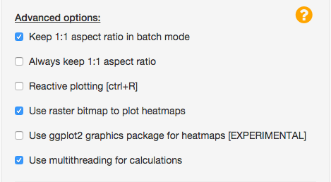

Advanced options
================

Some additional SeqPlots options are located at very bottom of the `Batch operation and setup` tab:

> 

* `Keep 1:1 aspect ratio in batch mode` - This option guarantee that the ratio between X- and Y-axis height will be 1, hence the produced plots will be square in batch mode. This prevents stretching the plots while fitting single rows or columns to one page. Turned on by default.

* `Always keep 1:1 aspect ratio` - This checkbox extends the 1:1 aspect ratio option to single plots. Turned off by default.

* `Reactive plotting` - When selected, all plotting operations are executed upon selection and will be visible in preview. `Reactive plotting` might be useful for exploratory data analysis using plots, but it is not recommended for heatmap plots because speed is decreased. Select/delelect from keyboard by pressing [ctrl/cmd+R]. Turned off by default.

* `Use multithreading for calculations` - This option is available only on desktop instances of SeqPlots under Mac OS X and Linux. While turned off R will not fork the child processes for plotting and plot set calculations. It is useful for debugging, since in single process mode all warning/errors will be directly printed to R console. Also might increase the performance for plotting small average plots. Turned off by default.

* `Use ggplot2 graphics package for heatmaps` - uses GGplot2 (http://ggplot2.org/) graphics system to draw the heatmaps. This feature is experimental.

