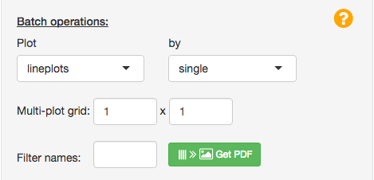
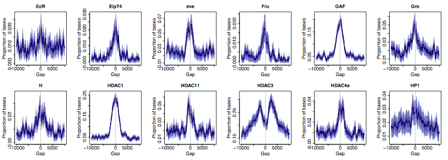

Batch operations 
================

Controls to plot multiple plots at once are located on the `Batch operation and setup` tab, just below PDF paper options. It is possible to output the plots to multipage PDF, plot an array of plots on a single page (for average plots) or mix these options together.

> 

The first drop-down controls the type of the plot - either average or heatmap. The second drop down determines the strategy to traverse the **plot grid**. The options include:

* `single` - every single feature-track pair will be plotted on separate plot
* `rows` - the **plot grid** will be traversed by rows, which means one plot that contains all tracks per feature will be prepared
* `columns` - the **plot grid** will be traversed by columns, which means one plot that contains all features per tracks will be prepared

The `multi plot grid` option controls how many plots will be placed on each page of the PDF output, e.g. 1x1 means one plot per one page, while 3x4 means 3 columns and 4 rows of plots. If number of plots exceeds the number of slots on page the new page will be added to the PDF.

`Filter names` will apply a filter to plot titles, which are based on on uploaded file names. For example, if you uploaded 100 files starting with a prefix of "my_experiment_", you can remove this fragment from each plot title and/or heatmap caption by putting this string in `Filter names`. 

Finally, pressing `Get PDF` produces the final output file. Please see example below:

> 
