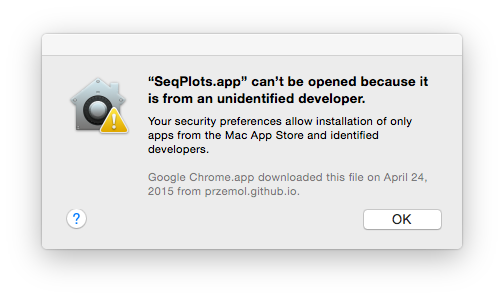
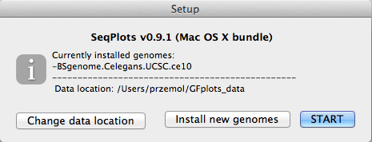
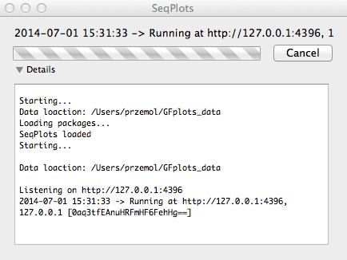

Installation - Mac OS X app
===========================

> The Mac OS X bundle is an easy way to use SeqPlots for Mac OS X users. It contains all R binaries and packages that SeqPlots depends on. Additionally, test tracks and genome annotations, and reference sequences for *Homo sapiens*, *Drosophila melanogaster* and *Caenorhabditis elegans* are included. Sequences for other organisms can be downloaded using a graphical user interface.

**System requirements**

* Mac OS X 10.6 (Snow Leopard) or higher

How to install
--------------

1. Download the compressed application from https://github.com/Przemol/seqplots_osx/releases/latest
2. Double-click on downloaded file to unzip the contents of archive
3. Drag and drop SeqPlots.app to Applications folder

How to start
------------

Start SeqPlots from Applications. If run for the *first time* the operating system security notice might be shown.

> 

To run the application right-click on SeqPlots icon and choose "Open", followed by clicking "Open" button in popup window.
This need to be done only once, later SeqPlots can be started as usual Mac OS X application.

> 

After starting SeqPlots the welcome screen displays the software version, the currently installed genomes and the data folder location.

> 

This screen allows you to set up following options:

* Change your data location folder - by default your home directory will be used (**`Change data location`** button)
* Exit application (**`Quit`** button)

Press the **`START`** button to initiate SeqPlots. If initiation was successful the user interface should open in your default web browser.

For SeqPlots usage instructions please refer to <b>Quick start demo</b> or specific chapters of this document.

The window in the background allows you to assess if SeqPlots is running properly and exit the application at any moment.

> 

The full progress bar indicates that SeqPlots is running. Press "Cancel" to stop it. Pressing "Details" will reveal a small text window that displays diagnostic and error messages.

Package content
---------------

* Platypus (http://www.sveinbjorn.org/platypus) wrapper
* R (http://www.r-project.org/) branch 3.1 for Snow leopard (http://r.research.att.com/snowleopard/R-3.1-branch/R-3.1-branch-snowleopard-sa-x86_64.tar.gz)
* SeqPlots dependency packages (including Shiny, rtracklayer and BSgenome)
* Full genome sequences for Caenorhabditis elegans (UCSC version ce10) - BSgenome.Celegans.UCSC.ce10 R package
* SeqPlots package
