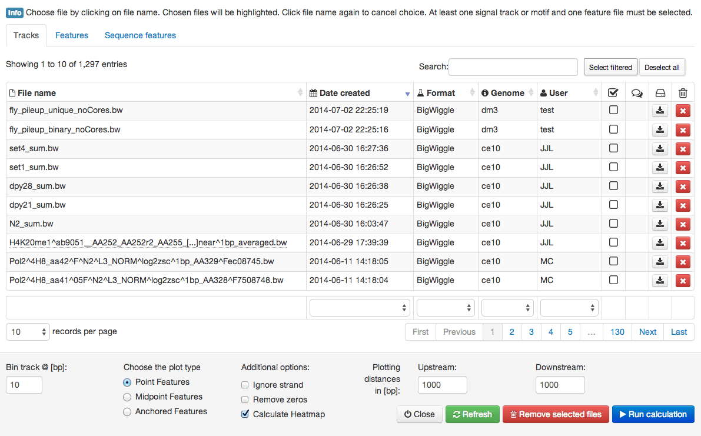
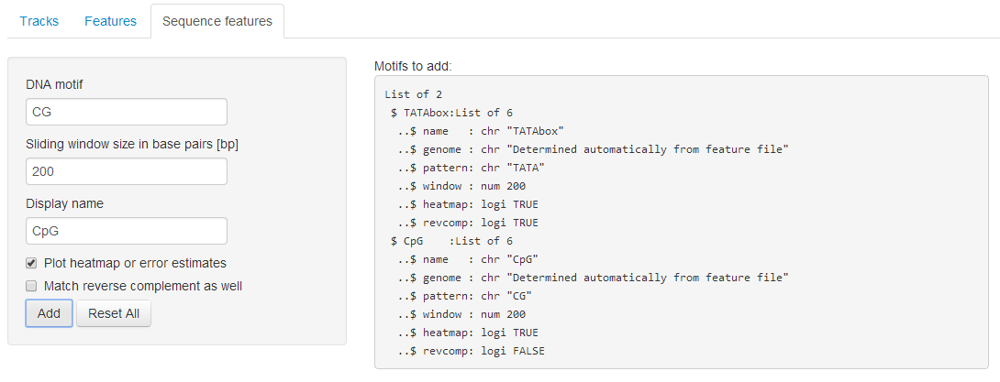
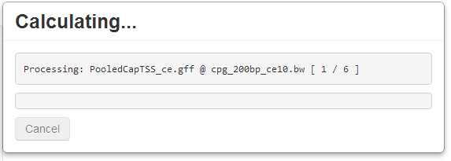
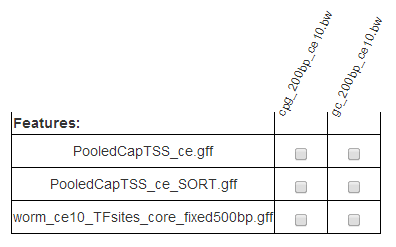

Running the plot-set jobs
=========================

Pressing the `New plot set` button brings up the **file collection window** from which you can choose signal tracks and feature files to calculate average plots and heat maps. If you wish to upload more files please refer to [adding new files documentation](Adding%20and%20managing%20files). The **file collection window** has three tabs:

* `Tracks` - signal files, i.e., Wiggle, BigWiggle and BedGraph files.
* `Features` - genomic feature files, i.e., BED, GFF and GTF files
* `Sequence features` - input any motif of interest that you want to plot.

> 

Selecting files
---------------

The `Tracks` and `Features` tabs displays information about the files and allows you to filter and sort by any column. The "Search:" dialog allows you to find any keyword in any field, while dropdowns below the file grid allow for more advanced filtering on specific columns. 

Select files by clicking on the file name or any other part of the row beside `Show comment` and `Download` or `Remove` buttons. Chosen files are highlighted in light blue. Clicking the file name again will cancel the selection. At least one signal track or motif and one feature file must be selected before starting the calculation.

Setting up plot options
-----------------------

Options controlling the plot settings is found below the file selection window:

1. **`Bin track @ [bp]:`** - this numeric input determines the resolution of data acquisition; the default value 10 means that 10bp intervals within the plotting range will be summarized by calculating the mean. Higher values increases the speed of calculation, but decreases resolution. See the [explanations](Terms).
2. **`Choose the plot type`** - there are three options:
    * *`Point Features`* - anchor plot on the start of a feature. By default, plot will be directional if strand information is present (i.e, use start position and plot on positive strand for \+ strand features and use end position and plot on negative strand for minus strand features).  If strand information is not present in the feature file (or if the "ignore strand" option is chosen), plot will use start position of feature and be plotted on the positive strand (see [explanations](Terms)).  User chooses length of upstream and downstream sequence to plot.
    * *`Midpoint Features`* - similar to point feature, but plot is centered on the midpoint of the feature.
    * *`Endpoint Features`* - similar to point feature, but plot is centered on the end of the feature. Strand information is used by default to determine the end side.
    * *`Anchored Features`* - features are anchored at start and stop positions and given pseudo-length chosen by the user. Additionally, the user chooses the length of sequence upstream of the start and downstream of the end to plot.
3. **`Ignore strand`** - the directionality (strand) will be ignored all features plotted on the positive strand.
4. **`Ignore zeros`** - signal values of 0 in the track will be be excluded from calculations
5. **`Calculate heatmap`** - selecting this generates and saves a heat map matrix.  Select if you wish to generate heatmap; uncheck if you only wish to generate average plots, as this will speed calculations.
6. **`Plotting distances in [bp]`** - the distances in to be plotted:
    * *`Upstream`* - the plotting distance in base pairs upstream to the feature 
    * *`Anchored`* - the pseudo-length, to which the features will be extended or shrunk using linear approximation (only for anchored plots)
    * *`Downstream`* - the plotting distance in base pairs downstream to the feature

Plotting sequence motif density
-------------------------------

The `Sequence features` tab allows you to calculate and plot the density of any user-defined motif around the chosen genomic feature using the reference sequence package. Motif plots can be mixed with track files' signal plots. The following options can be set:

1. **`DNA motif`** - the DNA motif 
1. **`Sliding window size in base pairs [bp]`** - the size of the sliding window for motif calculation. The value (number of matching motifs within the window) is reported in the middle of the window, e.g. if window is set to 200bp, DNA motif is "GC" and there are 8 CpGs in first 200 bp of the chromosome the value 8 will be reported at 100th bp.
1. **`Display name`** - The name of the motif that will be shown in key and heatmap labels. Leave blank to use `DNA motif` value. 
1. **`Plot heatmap or error estimates`** - this checkbox determines if heatmap matrix and error estimates should be calculated. If unchecked much faster algorithm will be used for motif density calculation, but only the average plot without the error estimates will be available.
1. **`Match reverse complement as well`** - select if reverse complement motif should be reported as well. For example the TATA motif will report both TATA and ATAT with this option selected.

> 

Clicking `Add` button adds the motif to plot set, while `Reset All` clears the motif selection. On the right side of the motif setting panel gives a list summary of included motifs.

Starting the plot set calculation
---------------------------------
The options are executed by pressing the `Run calculation` button. This dismisses the **file collection window** and brings up the calculation dialog, which shows the progress. On Linux and Mac OS X (systems supporting fork based parallelization) the calculation can be stopped using the `Cancel` button - this will bring back all settings in **file collection window**.

> 

After successful execution the **plot array** and **plot preview panel** will appear. In case of error an informative error pop-up will explain the problem. Please refer to the error section for further information.

> 

