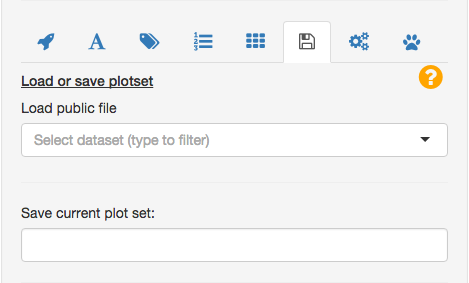

Saving and loading plotsets
============================

If desired, SeqPlots will save plot sets as binary R files, allowing you to quickly load the pre-calculated set for replotting. Saved plot sets can also be shared with other SeqPlots users.

Load or save plotset
--------------------

Controls available on the "Load or save plotset" panel:

-   **`Load saved plot set`** - drop-down list to select a plotset.
    Once the Rdata binary file is selected the **plot grid** will be displayed.
    Selecting the file reveals two additional buttons:
    - **`Remove dataset`** - this button deletes the selected saved plot set from user data.
    - **`Download plotset`** - this button saves a copy of the plotset in selected location.
-   **`Save current plot set`** - Enter desired name and press the `Save` button (appears after input of name). It is also possible to save a copy of loaded plot sets. The plot set binary files can be renamed simply by loading them, saving a copy and deleting original source file.

All saved dataset can be found in `data location`/publicFiles. Any SeqPlots Rdata binaries put in the folder will become available for loading in **`Load saved plot set`** control. 

> 

Plot set files structure
------------------------

The plot sets files can be also directly loaded in R. This allows further processing and customization of the plots. Data structure is a nested list, which elements be accessed by `[[` R operator. The nesting goes as follow:

- **`feature`** - R list
    - **`track`** - R list
        - `means` - numeric vector giving mean signal value for each (binned) genomic position
        - `stderror` - numeric vector giving standard error for each (binned) genomic position
        - `conint` - numeric vector giving 95% confidence interval for each (binned) genomic position
        - `all_ind` - numeric vector giving the genomic position in base pairs
        - `e` - character string giveing numeric vector giving the indicates of anchored distance, NULL for 
          point features plots
        - `desc` - auto generated title of the plot
        - `heatmap ` - numeric matrix, (binned) signal values for each genomic position (columns) and each feature (rows)

The example structure:

```{r eval=FALSE}
List of 2
 $ HTZ1_Differential_genes_TOP100_v2.gff:List of 2
  ..$ HTZ1_JA00001_IL1andIL2_F_N2_L3_NORM_linear_1bp_IL010andIL009_averaged.bw    :List of 7
  .. ..$ means   : num [1:501] 2.52 2.52 2.52 2.53 2.54 ...
  .. ..$ stderror: num [1:501] 0.114 0.112 0.111 0.11 0.109 ...
  .. ..$ conint  : num [1:501] 0.226 0.223 0.221 0.218 0.217 ...
  .. ..$ all_ind : num [1:501] -1000 -995 -990 -985 -980 -975 -970 -965 -960 -955 ...
  .. ..$ e       : NULL
  .. ..$ desc    : chr "HTZ1_JA00001_IL1andIL2...\n@HTZ1_Differential_genes_TOP100_v2"
  .. ..$ heatmap : num [1:100, 1:501] 2.36 5.25 2.2 3.48 4.32 ...
  ..$ HTZ1_JA00001_IL3andIIL5_F_lin35_L3_NORM_linear_1bp_IL008andIL011_averaged.bw:List of 7
  .. ..$ means   : num [1:501] 2.36 2.35 2.35 2.36 2.38 ...
  .. ..$ stderror: num [1:501] 0.126 0.125 0.125 0.126 0.125 ...
  .. ..$ conint  : num [1:501] 0.249 0.249 0.247 0.251 0.249 ...
  .. ..$ all_ind : num [1:501] -1000 -995 -990 -985 -980 -975 -970 -965 -960 -955 ...
  .. ..$ e       : NULL
  .. ..$ desc    : chr "HTZ1_JA00001_IL3andIIL5...\n@HTZ1_Differential_genes_TOP100_v2"
  .. ..$ heatmap : num [1:100, 1:501] 2.61 3.17 1.42 2.46 4.26 ...
 $ HTZ1_Differential_genes_BOTTOM100.gff:List of 2
  ..$ HTZ1_JA00001_IL1andIL2_F_N2_L3_NORM_linear_1bp_IL010andIL009_averaged.bw    :List of 7
  .. ..$ means   : num [1:501] 1.57 1.57 1.58 1.6 1.62 ...
  .. ..$ stderror: num [1:501] 0.0996 0.0985 0.1003 0.1022 0.1018 ...
  .. ..$ conint  : num [1:501] 0.198 0.195 0.199 0.203 0.202 ...
  .. ..$ all_ind : num [1:501] -1000 -995 -990 -985 -980 -975 -970 -965 -960 -955 ...
  .. ..$ e       : NULL
  .. ..$ desc    : chr "HTZ1_JA00001_IL1andIL2...n@HTZ1_Differential_genes_BOTTOM100"
  .. ..$ heatmap : num [1:100, 1:501] 1.64 1.37 1.61 1.77 1.86 ...
  ..$ HTZ1_JA00001_IL3andIIL5_F_lin35_L3_NORM_linear_1bp_IL008andIL011_averaged.bw:List of 7
  .. ..$ means   : num [1:501] 1.94 1.94 1.95 1.96 1.97 ...
  .. ..$ stderror: num [1:501] 0.123 0.123 0.124 0.126 0.128 ...
  .. ..$ conint  : num [1:501] 0.244 0.245 0.246 0.251 0.253 ...
  .. ..$ all_ind : num [1:501] -1000 -995 -990 -985 -980 -975 -970 -965 -960 -955 ...
  .. ..$ e       : NULL
  .. ..$ desc    : chr "HTZ1_JA00001_IL3andIIL5...\n@HTZ1_Differential_genes_BOTTOM100"
  .. ..$ heatmap : num [1:100, 1:501] 1.61 1.37 1.29 3.04 3.77 ...

```
